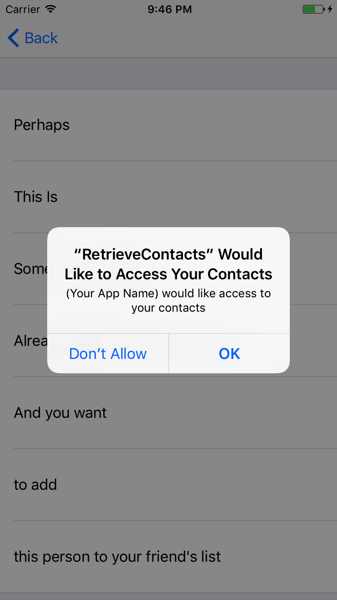
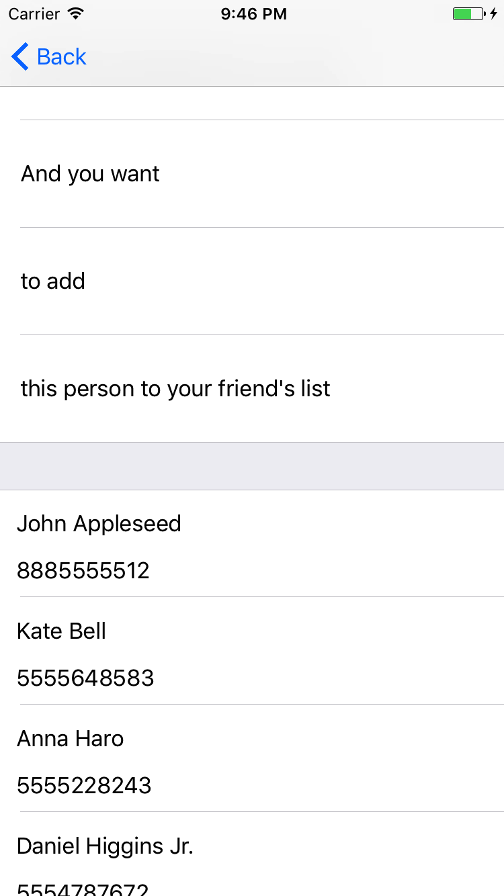

# RetrieveContacts-IOS-Programmatically-
Programmatically retrieves all contacts from a user's phone book and displays them in a UITableView. All is done without the use of a storyboard

This is just a simple way of retrieving a user's phone book. Perhaps you'd like to display all the users who are both in your contacts and have signed up for your app.
For example, take a typical social media app: If you want to add someone from your contacts to your friend's list who has also signed up for the app but you did not know

 
 

 

 

